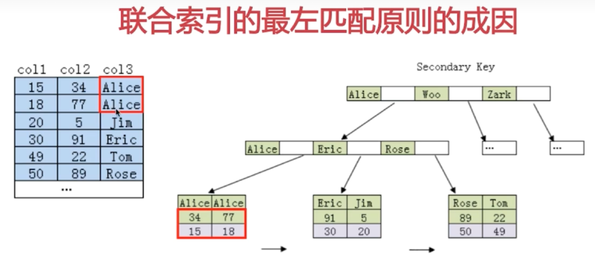

# MySQL


## 1. 如何设计一个关系型数据库

**RDBMS**

| 程序实例         |
| ---------------- |
| 存储（文件系统） |

- 程序实例

	- 存储管理： 数据的格式和文件的分隔进行统一的管理 【**优化存储： 减小IO次数**， 因此数据库用块或者页方式来存储数据】
	- 缓存机制： 把需要的数据存放在缓存中，等下一次需要的时候，再读取。，但是一旦某行数据被访问了，**它周围的数据也极有可能被访问的经验**，缓存的非本质数据也能起到优化访问效率的作用，提升访问的性能。**管理缓存的方法有LRU等**。
	- SQL的解析模块： 需要SQL解析模块将SQL编译解析，转换成机器可识别的指令。**可使用缓存**， 缓存不易过大，且需要淘汰机制。
	- 日志管理模块： SQL操作需要记录下来，**方便数据库的主从同步或者灾难恢复**，因此需要日志管理对操作进行记录，如binlog的记录方式。
	- 权限划分： 需要提供给用户管理数据的私密空间，即权限划分
	- 容灾机制：当数据库挂了如何恢复，恢复到什么程度。
	- **索引管理：**优化数据查询效率
	- 锁模块： 使得数据库支持并发操作

- 存储（文件系统）

	将数据持久化存入磁盘中，如存入机械硬盘、SSD固态硬盘、亦或者是它们的磁盘阵列矩阵中


## 2. 索引模块

- 为什么要使用索引
- 什么样的信息能成为索引
- 索引的数据结构
- 密集索引和稀疏索引的区别


### 1. 为什么要使用索引

不使用索引： 全表扫描， 多次IO【读取页、段】，大数据十分缓慢

- 快速查询
	- **关键信息和查找信息的方式组成索引，通过索引可以大幅提升查询速度。**
- 保证每一行的唯一性【唯一索引】
- 随机IO变成顺序IO
- 避免排序和临时表
- 加快表连接

### 2. 什么样子的信息能成为索引

主键、唯一键、普通键

（把记录限定在一定查找范围内的字段，主键便是一个很好的切入点，其他包括唯一键、普通键等也可以作为索引。）

```
直接创建索引
-- 创建唯一索引
CREATE UNIQUE INDEX index_name ON table_name(col_name);
-- 创建普通索引
CREATE INDEX index_name ON table_name(col_name);
-- 创建唯一组合索引
CREATE UNIQUE INDEX index_name ON table_name(col_name_1,col_name_2);
-- 创建普通组合索引
CREATE INDEX index_name ON table_name(col_name_1,col_name_2);
 
通过修改表结构创建索引
ALTER TABLE table_name ADD INDEX index_name(col_name);
 
创建表的时候直接指定
CREATE TABLE mytable(
       id INT NOT NULL, 
       username VARCHAR(16) NOT NULL, 
       INDEX [indexName] (username(length))

```


### 3. 索引的数据结构

- 二叉查找树
- B    -Tree结构
- B+  -Tree结构
- Hash结构

#### 3.1 二叉查找树（非平衡）

使用二分查找来查找相关的数据  `O（logN）`

#### 3.2 AVL二叉树（完全平衡二叉树）

查找、 删除、 插入都是 `O（logN）`


二叉树： 每查找一次，都要进行一次**IO**， 由于只有两个子节点， 所以IO次数很多， 检索性能很差。


#### 3.3 B-Tree  （多叉树）


**3-阶b - Tree**

通常 m 很大

**特征**

- root 至少有2个子节点
- 每一个节点最多有m个子节点 （m>=2） 
- 非根、 叶节点， 最少有 ceil(m/2)个子节点
-  所有叶子节点都处于同一层
- 每一个非叶节点有n个关键字
	- 关键字升序排列
	- 关键字个数n 满足：  [ceil(m/2)-1]<= n <= m-1
	- 非叶子节点的指针： P[1] , P[2] , .. , P[M] , 其中P[1] 指向关键字小于K[1]的子树，P[M]指向关键字大于K[M-1] 的子树， 其他P[i]指向 (K[i-1], K[i])
	- 意思是 第一个P指向 比key[1]小的区间  最后一个key指向比key[M-1]大的区间， 剩下的就是指向(K[i-1], K[i])
- 数据变动时，通过   5个规定，使用  **合并， 分裂  上移下移节点** 来保证树的特征。


#### 3.4 B+ Tree


**特征**

- 非叶子节点的子树的指针与关键字个数相同【可以存储更多关键字】
- P[i] 指向    [ K[i] , K[i+1] ) 关键字范围
- 叶子节点才**存储了真正的数据**！【数据文件的指针  或者  目标数据】
- B+树检索  ： 从根到叶子节点 才会结束， 非叶子节点 只存储索引【可以让树更矮】
- **所有叶子节点有一个叶指针， 指向下一叶子节点** 按照**大小顺序连接**：
	- 作用： 在叶子节点**做范围统计  【大于等于 。。。。。】**


**B+ 树更适合用来储存索引**

- B+树磁盘读写代价更低
- 查询效率更加稳定  必须从叶子到根
- 有利于数据库的扫描，   遍历叶子节点， 可以提高元素遍历能力。 B树只解决了IO读写的效率。B+树只需要遍历叶子节点的关键字，就可以完成对全部关键字信息的扫描


#### 3.5 Hash索引

查询效率很高   O（1）

**缺点：**

- 不能进行范围查询   >  <   只能进行   =     in ()
- 无法利用索引来进行排序运算
- 不能利用部分索引查询
	- 部分索引： 组合索引后重新计算索引值， 完全无关了
- 不能避免表扫描
	- 因为  将索引键通过hash扫描 至 hash值 然后将hash值和对应的行信息存放在bucket当中，由于有hash冲突【多健对一】 所以依旧需要比较bucket中的数据。
- 需要大量Hash值冲突的索引， 查询效率很低


#### 3.6 BitMap 神器


某个属性只有个值  ： 性别 男女

效率极高  

**但是锁的安全性很高，不适合高并发的系统**


### 4. 密集索引和稀疏索引的区别【聚焦索引、 非聚焦索引】

- 

**密集索引：** 密集索引文件中， 每一个搜索码值都对应一个索引值

- 叶子节点保存的不只是键值， 还保存着同行列的其他信息
- 决定了表的物理排列顺序， 一张表一个密集索引


**稀疏索引：** 稀疏索引文件中， 只为索引码的某些值建立索引项

- 叶子节点： 保存键位信息和该行数据的地址  【有的仅保存键位信息及其主键】 ，
-  需要通过主键和地址进一步定位数据


#### InnoDB  【必须有密集索引】

- 主键被定义： 主键就是**密集索引**
- 主键没有定义： 第一个唯一非空索引就是**密集索引**
- 如果没有以上条件， innodb会内部自定义一个**隐藏主键**   密集索引 6字节的主键
- 非主键索引存储的是相关键位以及其对应的主键值，包含两次查询


InnoDB 有两个数据文件


### 5. InnoDB 和 MyISAM

#### MyISAM

**优点：** 访问速度快

**场景：** 

- 对事物的完整性没有要求， 或者以  **select  insert** 为主要的应用， 使用myISAM
- 频繁执行全表count语句 【保存行数】
- 对数据进行增删改频率不高， 使用MyISAM， 查询频繁
- 

**特点：**

- **不支持事务、 外键**

- 一张表有三个文件

	- .frm  储存表的定义
	- .MYD -- my data 储存数据
	- .MYI  --- MyIndex 储存索引

	数据文件和索引文件可以放在不同的目录，平均分布IO， 加快访问速度

- 三种存储格式

	- 静态表【默认】
		- 特点： 字段全是定长的， 存储快， 易恢复， 占用空间大【会补空格】
	- 动态表
		- 特点： varchar， 动态表， 占用空间小， 但更新会有碎片， 难以恢复
	- 压缩表：
		- 特点： 占用空间小

- **非聚焦索引**

	- MyISAM的B+树主键索引和辅助索引的叶子节点都是数据文件的地址指针。

- 只支持表级锁

------

#### InnoDB

**场景：** 

- 对事物完整性有较高要求， 在并发场景下要求数据一致性 【可靠性高】
- 数据增删改查都比较频繁

**优点**： 有 提交 回滚 的事务功能， 崩溃恢复的事务安全功能

**缺点：**相比于MyISAM，处理速度慢， 占用更多的磁盘空间

**特点：**

- 自动增长列
	- innoDB表的自动增长列必须是索引，如果是组合索引，也必须是组合索引的第一列
	- MyISAM自动增长列可以是其他列
- 外键约束
	- 只有**InnoDB**支持外键
- 一张表有两个文件
	- .frm 表结构
	- .ibd   索引+数据
- **聚焦索引**
	- 使用B+Tree作为索引结构， 数据文件和（**主键索引**）绑定在一起【idb文件】， 通过主键查询效率很高，但是辅助键则需要**两次查询**， **主键不建议过大。主键也要有序**
	- InnoDB的B+树主键索引的叶子节点就是数据文件，辅助索引的叶子节点是主键的值；而MyISAM的B+树主键索引和辅助索引的叶子节点都是数据文件的地址指针。
- 不保留行数【因为不同事务， 行数不一致】
- 支持行级锁
- 支持事务和外键
- 支持**MVCC**


### 6. 如何定位并优化慢查询SQL

- 根据慢日志定位慢查询SQL

	- 记录执行很慢的SQL
		- show variables like '%quer%' -- 
			- set global slow_query_log = on
			- set global long_query_time = 1
		- show status like %slow_queries%  -- 慢查询数量

- 使用explain等工具分析sql

	- Explain sql    分析sql的执行方式

	- ```
		explain select name from person_info_large order ny name
		```

	- EXPLAIN 关键字段

		- type  ： index   >  all   说明是全表扫描
		- extra :   出现以下两个
		- 

- 使用索引加速查询 修改sql， 让sql走索引

	- ```
		explain select account from person_info_large order by account
		```

		

- 加索引

	- ```
		alter table person_info_large add index idx_name(name)
		```


**注意**

```
explain select count(id) from person_info_large;
```

**id: 主键**

**account： 唯一键**

Mysql默认使用 查询优化器来进行查询优化，尽可能使用索引 使用最严格的索引来消除尽可能多的数据行， 最终目标： **提交select语句查询数据行**

使用唯一键原因： 密集索引的叶子节点的数据，把其他数据也放入其中，但稀疏索引只有主键值，所以使用稀疏索引。


### 7. 联合索引的最左匹配原则

**联合索引： 多列组合的索引**

- 例如 联合索引  (a, b)  

	```
	当查询   `where a = ? and b = ?`   会走联合索引	
	查询  where a = ?   ===>           使用联合索引
	查询  where b = ?   ===>           全表扫描
	```

- 定义

	- mysql会一直**向右匹配直到遇到范围查询** 【 >  <  between   like 】
		- (a, b, c, d)     a=3  and  b = 4 and  c> 5 and d = 6
		- 那么  d是用不到索引的，  如果建立   (a, b, d, c) 则是可以
	-  = 和 in 中是可以乱序的，   **优化器可以识别**

**成因：**

1. 对左边的索引 的字段 排序

2. 在第一个字段排序的基础上 排序字段二

	字段一  绝对有序  字段二 无序， 所以第二个条件中  如果使用条件判断， 用不到索引





(col3 ，  col2) 


### 8. 索引不是越多越好

数据量小的表，不需要建立索引，建立索引会增加额外的索引开销

数据变更需要维护索引，更多的索引意味着更多的维护成本

更多的索引意外着更多的空间

### 

## 3. 锁模块

- MyISAM 和 InnoDB 关于锁方面的区别是什么
- 数据库事务的四大特性
- 事务隔离级别以及各级别下的并发访问问题
- InnoDB可重复读级别下如何避免幻读
- RC、 RR 级别下InnoDB的非阻塞读如何实现


#### 1. MyISAM 和 InnoDB关于锁方面的区别

**MyISAM默认的是表级锁， 不支持行级锁   不支持事务**

**InnoDB默认的是行级锁， 支持表级锁   支持事务**


MYISAM： 

在进行查询时， 会自动给表加一个**表级别的读锁**， 等查询完，才释放读锁。 此时 别的session可以增加读操作， 但是**写操作被block掉了**

在进行增删改时， 会自动给表加一个**表级别的写锁**， 等查询完，


```
读锁：  lock tables person_info_myisam read  [读锁]
```

**读锁也叫共享锁**


- **共享锁（s） ** lock in share mode

	**共享锁（Share Locks，简记为S）又被称为读锁**，其他用户可以并发读取数据，但任何事务都不能获取数据上的排他锁，直到已释放所有共享锁。

	共享锁(S锁)又称为读锁，若事务T对数据对象A加上S锁，则事务T只能读A；其他事务只能再对A加S锁，而不能加X锁，直到T释放A上的S锁。这就保证了其他事务可以读A，但在T释放A上的S锁之前不能对A做任何修改。

- **排他锁（X）：**  for update  

	**排它锁（(Exclusive lock,简记为X锁)）又称为写锁**，若事务T对数据对象A加上X锁，则只允许T读取和修改A，其它任何事务都不能再对A加任何类型的锁，直到T释放A上的锁。它防止任何其它事务获取资源上的锁，直到在事务的末尾将资源上的原始锁释放为止。在更新操作(INSERT、UPDATE 或 DELETE)过程中始终应用排它锁。


**当不走索引的时候， 最后整张表还是会被锁住！** 使用的是**表级锁**

在使用到索引的时候， 会使用的是**GAP锁和行级锁**， 


**行级锁要扫描到特定行，对其上锁， 代价比较大**

InnoDB支持事务，但是相对而言， 开销也变大了


#### 2. 表的分类

- 锁的颗粒： 表级锁 、 行级锁 、 页级锁
- 锁的级别： 共享锁、 排他锁
- 加锁方式： 自动锁、 显式锁
- 操作：   DML 锁 、 DDL 锁
- 使用方式： 乐观锁 、 悲观锁【数据库的锁机制， 全程用排他锁锁定】 


**悲观锁**

当要对数据库中的一条数据进行修改的时候，为了避免同时被其他人修改，最好的办法就是直接对该数据进行加锁以防止并发。这种**借助数据库锁**机制，在修改数据之前先锁定，再修改的方式被称之为悲观并发控制【Pessimistic Concurrency Control，缩写“PCC”，又名“悲观锁”】。

**具有强烈的独占和排他特性**


**乐观锁 **【**使用版本的机**制！】

乐观锁是相对悲观锁而言的，乐观锁假设数据一般情况下不会造成冲突，所以在数据进行提交更新的时候，才会正式对数据的冲突与否进行检测，如果发现冲突了，则返回给用户错误的信息，让用户决定如何去做。**乐观锁适用于读操作多的场景**，这样可以提高程序的吞吐量。


**CAS 实现**：Java 中java.util.concurrent.atomic包下面的原子变量使用了乐观锁的一种 CAS 实现方式。

**版本号控制**【时间戳】：**一般是在数据表中加上一个数据版本号 version 字段**，表示数据被修改的次数。当数据被修改时，version 值会+1。当线程A要更新数据值时，在读取数据的同时也会读取 version 值，在提交更新时，若刚才读取到的 version 值与当前数据库中的 version 值相等时才更新，否则重试更新操作，直到更新成功。

**乐观锁**实现  【不会有**死锁**的时间】

```
1. 先读取需要修改的数据的version的值
select version from db where id = 2;
2. 根据version实现乐观锁
更新 version
update db set money set money = 123, version = 0 + 1 where id = 2 and version = 0;

```


#### 3. 数据库事务的四大特性

ACID

- 原子性 （Atomic）   事务要么全做， 要么全不做
- 一致性  （Consistency） 数据库 从**一个一致状态** 到另一个**一致状态**  一致状态： 满足
- 隔离性  （Isolate）    并发访问数据库时， 一个用户的事务不被其他事务锁干扰， 各个并发的事务事务之间的数据库时独立的
- 持久性   （Durablity） 对数据库的改变是持久的
	- dbms的恢复性能  使用日志恢复
	- innodb  redolog 文件， 记录所有的修改操作， 可恢复数据库

**binLog日志**


#### 4. 事务隔离级别以及各级别下并发访问的问题

- 丢失更新——  一个事务A修改后 另一个事务B修改       事务B修改的更新丢失
	- Mysql完全避免了
	- 
- 脏读  ： **读未提交**  read-commit 级别以上可以避免
	- 读取其他事务中， 没有提交的数据,并在这个数据的基础上操作了数据库， 操作可能是错误的
- 不可重复读：**读已提交**  在一个事务中， 两次读取到的数据不一致【在这个时间有数据被事务B修改并提交】
	- read-repeat可以解决 【可重复读可以解决】
- 幻读:   是事务A 锁了几行后， 事务B**插入**了一些数据并提交， 事务A之后查询发现多了几条不存在的数据。
	-  **串行读 可以解决**
	- **InnoDB** 在 **可重复读的隔离级别下  解决了幻读**


#### 5. InnoDB RR 可重复读隔离级别下如何避免幻读的

表象： 快照读(非阻塞读) -- 伪MVCC

内在： next-key锁   （行锁+ gap锁）


**当前读**：

```
select ... lock in share mode , select ... for update

update, delete, insert 【默认加排他锁】
```

当前读： 加了锁的增删改查语句

读取是最新版本， 并且保证其他事务不能修改， 对读取的记录加锁


**快照读：** 不加锁的非阻塞读， select  


**MVCC： 多版本控制， 提高并发的技术  修改时， 先保存当前版本的数据**

- InnoDB通过undolog 找回历史版本数据 （用于读历史数据 或者回滚数据）
- 是行级锁的变种， 在大部分情况下避免加锁的操作， 开销低
- 有乐观并发和悲观并发
- 在  读提交  和  可重复读   下工作
	- 读未提交  不符合事务  
	- 可重复读  所有行加锁了
- 在 RR下  第一次读取就是快照读
	- 将其他活跃的事务记录起来
	- 然后 读取都是read view 快照读
- 在RC下， 每一个select语句， 创建一个快照
	- 将其他活跃的事务记录起来
	- 然后 读取都是read view 快照读
	- 这样子就实现了 读已提交


**InnoDB ： 是伪MVCC  并没有实现多版本共存**


##### RC、 RR级别下的InnoDB的非阻塞读如何实现  【undo log】

- 数据行的 DB_TRX_ID DB_ROLL_PTR DB_ROW_ID

```
DB_TRX_ID      	表示最新一次对本行记录修改的事务id
DB_ROLL_PTR		回滚指针  ： 用来记录回归记录所必须的信息 undo log 日志 
DB_ROW_ID		行号：      随着新行插入单调递增的行id   不会出现在任何索引中  【就是隐藏的】
```

- 通过**undolog** 找回历史版本数据 （用于读历史数据 或者回滚数据） 

	- insert undolog 
		- insert 操作产生的undo log   只在事务回滚时生效， 事务结束就丢弃
	- update undolog
		- Update undolog 事务需要， 快照读也需要， 快照读不需要才回删除

	

- read view 可见性算法 


##### 内在： next-key锁（行锁+gap锁）

**行锁：** 对单个记录上锁

**Gap锁：** 锁定一个范围， 不包括记录本身

**Gap锁： 只在读可重复才有**


**对于主键索引或者唯一索引会用Gap吗**

- 如果where全部命中， 那么不会使用Gap锁  只会加记录锁  【使用 id = XXX】


- 如果where中 部分命中， 或者 全不命中， 则加Gap锁  锁定一个范围


Gap锁会用在**非唯一索引**或者**不走索引**的**当前读**中


**Gap锁， 锁住 空白的行！！！**


### 4. log

#### 1. redo log 重做日志

作用： 

- 保证事务的持久性 。redo日志记录事务执行后的状态，用来恢复未写入data file的已成功事务更新的数据。
- 用来恢复未写入data file的已成功事务更新的数据

#### 2. undo log 回滚日志

**作用：**

　　保证数据的原子性，保存了事务发生之前的数据的一个版本，可以用于回滚，同时可以提供多版本并发控制下的读（MVCC），也即非锁定读

#### 3. bin log 二进制日志

**作用：**

　　用于复制，在主从复制中，从库利用主库上的binlog进行重播，实现主从同步。

　　用于数据库的基于时间点的还原。


### SQL 关键语法

- Group by
- having
- count sum max min


#### 1. Group by 

- Select 子句必须是 分组列或者 列函数  只针对同一个表
- 列函数对于group by 子句中定义的每一个组返回一个内容
